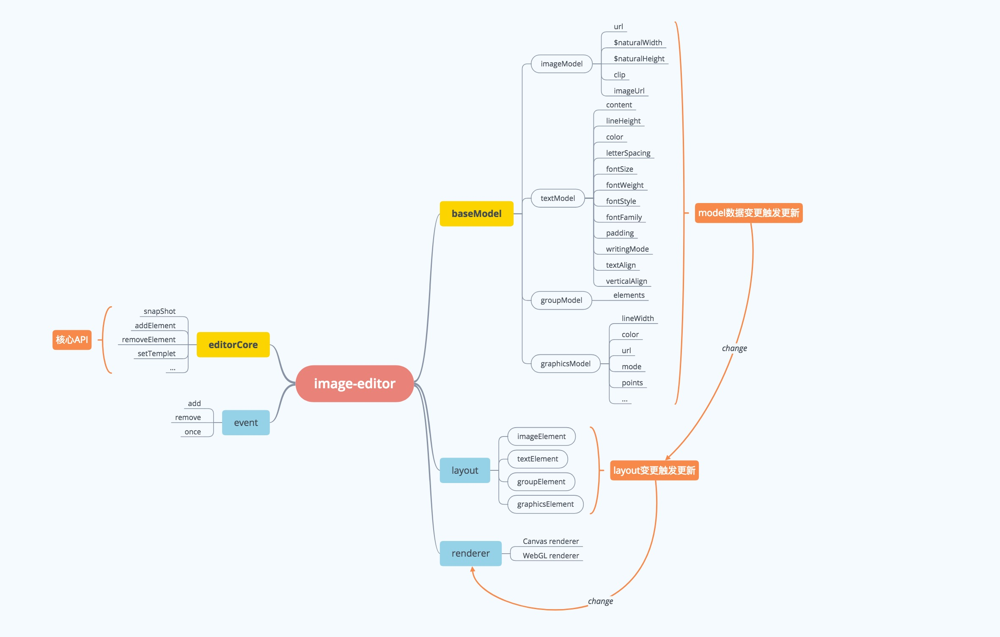

### A edit tool for image

```bash
// 安装依赖
npm install

// 开发环境构建打包
npm run build:dev

// 生产环境构建打包压缩
npm run build:prod
```
### 脑图

;

```
src
├── constants       ### 常量
├── core            ### 核心API
├── index.ts        ### 入口文件
├── interfaces      ### 接口定义
├── model           ### model定义
├── renderers       ### 渲染引擎
├── utils           ### 工具库
├── views           ### 组件
└── widgets         ### 小组件
```
